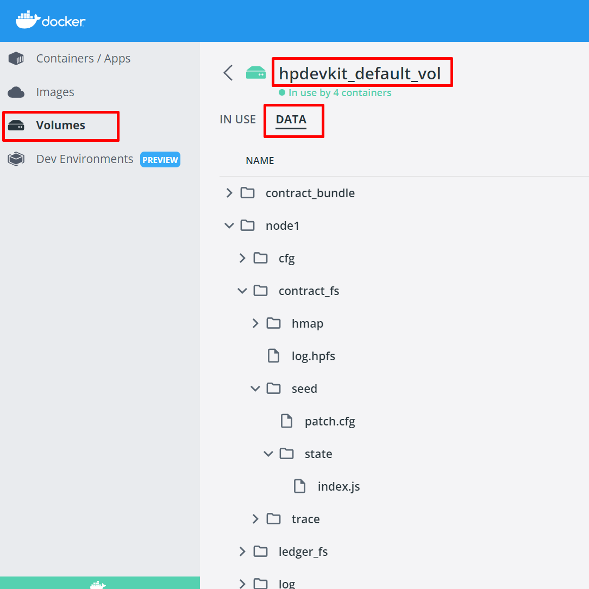

# Evernode All-in-One Developer Kit

This package consolidates existing CLI tools, such as `hpdevkit` and `evernodecli`, along with Evernode development-related npm packages, into a single development kit. Depending on the installation mode, it can function either as a CLI tool or as a composite npm package.

## Install as a CLI Tool (Global)

### Prerequisites

The Evernode Kit requires the installation of [Node.js](https://nodejs.org/en/) on your development machine, as well as [Docker](https://www.docker.com/) to function as a CLI tool.

### Cross-Platform Support

This is a global npm package that supports both Linux and Windows.

1. Install the [prerequisites](#prerequisites).
2. Run the following command to install `evernode` on your machine:
    ```bash
    npm install evernode -g
    ```

### Usage

Once installed as a CLI tool, use the `evernodecli` command to interact with the kit. To view the available commands, run:
```bash
evernodecli help
```

## Creating a HotPocket smart contract

You can use the HotPocket developer kit to generate smart contract projects such that everything is pre-configured. Here, we are creating a NodeJs smart contract (This assumes you have prior experience with developing NodeJs applications):

```
evernodecli hp-gen nodejs starter-contract myproj
cd myproj
npm install
npm start
```

The 'npm start' command will build and deploy the NodeJs smart contract into a HotPocket cluster running on your machine. It will also start printing the console output from the HotPocket instance. You can press Ctrl+C at any time to exit from monitoring the HotPocket console output. However, the HotPocket instance will continue to run even after you exit the monitoring console.

### Viewing logs

You can re-enter the monitoring console with the command `evernodecli hp-logs 1`, where `1` is the HotPocket instance number you wish to monitor.

### Changing the cluster size

In order to resize the HotPocket cluster, you need to delete and re-create it:

_**NOTE:** This will delete the running app cluster. you will lose the app data._

1. Delete the existing cluster using the `evernodecli hp-clean` command.
2. Set the HP_CLUSTER_SIZE environment variable to the size you want.

   ```
   # Windows (command prompt)
   set HP_CLUSTER_SIZE=5

   # Windows (powershell)
   $env:HP_CLUSTER_SIZE=5

   # Linux (bash)
   export HP_CLUSTER_SIZE=5
   ```

3. Deploy your contract again with `npm start`.

## Creating HotPocket client application

You can use the HotPocket developer kit to generate a HotPocket client application such that everything is pre-configured. Here, we are creating a NodeJs client (This assumes you have prior experience with developing NodeJs applications):

```
evernodecli hp-gen nodejs blank-client myclient
cd myclient
npm install
node myclient.js
```

This will start the client application and connect a HotPocket node listening to port 8081. Also, note that you need to have HotPocket nodes running on your machine for the client to connect.

## Listing available code templates

You can use the `evernodecli hp-templates` command to list all available comtract and client code templates. 

```
evernodecli hp-templates <platform>
```
- `<platform>` is an optional parameter that can be used to filter code templates based on the platform they are designed for.

## Deploying contract files directory to the cluster

You can use the `evernodecli hp-deploy` command to deploy a specified contract file directory to a HotPocket cluster.

```
evernodecli hp-deploy <contract-files-directory>
```
- `<contract-files-directory>` should contain the path of the contract directory to be deployed.
- The following options can be specified with this command:

  | Name                              | Description                         |
  | --------------------------------- | ----------------------------------- |
  | `-m, --multi-sig [multi-sig]`     | Multi-signing enabled.            |
  | `-a, --master-addr [master-addr]` | Master address for multi-signing. |
  | `-s, --master-sec [master-sec]`   | Master secret for multi-signing.  |


## Advanced usage

```
# Stop and clean-up everything (required for changing cluster size)
evernodecli hp-clean

# View a specific node's logs
evernodecli hp-logs <node number>

# Start/stop all nodes
evernodecli hp-start
evernodecli hp-stop

# Start/stop a specific node
evernodecli hp-start <node number>
evernodecli hp-stop <node number>

# Add a new node to the cluster
# (The new node will use the existing UNL and become an observer node)
evernodecli hp-spawn
```

If the contract files directory also contains a file named `hp.cfg.override`, it will be used to override the hp.cfg of all nodes. This can be used to set contract-specific parameters like 'bin_path' and 'bin_args'

An example `hp.cfg.override` file for a NodeJs application (the HotPocket developer kit NodeJs starter contract automatically includes this file for you):

```
{
    "contract": {
        "bin_path": "/usr/bin/node",
        "bin_args": "app.js"
    }
}
```

### Inspect contract files of all nodes

You can inspect the files of all the nodes of the cluster using Docker Desktop.



## Get Host Details

You can use the `evernodecli host-info` command to get the details of a one particular host or a set of given hosts on Evernode.
```
evernodecli host-info
```
Please note that this connects by default to `wss://xahau.network`. If you wish to use your own node then please specify Environment Variable `EV_XAHAUD_SERVER=wss://...`


This command supports following options for sorting and filtering the output.

| Name                                | Description                                                       |
| ----------------------------------- | ----------------------------------------------------------------- |
| `-h, --host-address [host-address]` | Host address to search for a single host                          |
| `-f, --file-path [file-path]`       | Path to a file containing a list of host addresses (one per line) |
| `-o, --output [output] `            | Directory to save the resulting host details                      |

## Acquiring instance from Evernode
You can use the Evernode developer kit to acquire instances from Evernode. This will create you a fresh Evernode instance where you can deploy your DApps.
- You are required to set `EV_TENANT_SECRET` and `EV_USER_PRIVATE_KEY` [environment variables](#environment-variables) before acquiring the instance.
- To override configurations of Evernode instance's You can create a [HotPocket configuration](../../hotpocket/reference/configuration.md) file and set its path as `EV_HP_INIT_CFG_PATH` [environment variable](#environment-variables).
- You can set `EV_NETWORK` "(mainnet|testnet)" to override the Evernode network used for instance creation, Otherwise defaults to "mainnet".
- The following command will create an instance in the given host. Given configurations will be populated if `EV_HP_INIT_CFG_PATH` is given.
```
evernodecli acquire <host-Xahau-address>
```
- This will return the acquired instance details.

## Deploying a contract to Evernode
You can deploy your already implemented [DApp](../../../platform/hotpocket/overview.md#dapp) to the acquired Evernode instance.

### Creating the deployable contract package
You can package your contract using evernodecli.
- To override Evernode instance's configurations when you are deploying (Note: Currently this supports only `contract` and `mesh.known_peers` sections). You can create a [Contract configuration](../../hotpocket/reference/configuration.md#contract) file and set its path as `EV_HP_OVERRIDE_CFG_PATH` [environment variable](#environment-variables).
```
evernodecli bundle <path-to-contract-directory> <public-key-of-the-instance> <contract-binary> -a <contract-binary-arguments>
evernodecli bundle $HOME/contract ed060a4aae0ec9183e4869e1490e908c9a9a3fd72816021c823ecd7d052e6e02d2 /usr/bin/node -a index.js
```
Note that,
- **path-to-contract-directory:** This path should be an absolute path and it should point to the directory containing the final deployable contract files. The contents of this directory must align with your specified contract configurations.
  - For Node.js contracts: The directory should include relevant contents that match the `bin_args` field in your contract configuration.
  - For C contracts: The directory should contain the relevant binary file specified in the `bin_path` field.
  - Ensure that the directory accurately reflects the deployable contents according to the contract type and configuration.

### Uploading a contract to Evernode
You can upload your contract bundle to the Evernode instance
- You are required to set `EV_USER_PRIVATE_KEY` [environment variable](#environment-variables) before uploading the contract.
```
# evernodecli deploy <path to contract bundle> <domain / IP of the instance> <User port of the instance>
evernodecli deploy $HOME/bundle/bundle.zip 45.76.238.97 26201
```
For clarity, suppose you got the following from acquiring an instance:
```js
{
  name: "AC53DF1598E419E333F6304A0A5C7581599F20CCF5CF58312337AD0848A2E30D",
  pubkey: "ed748d39effb987b34b4d205eef5e3bec7297d481c1f31fa283ca1637f8cb2d152",
  contract_id: "03d85fbc-a8b2-42ba-923e-5a5a0406bb5e",
  peer_port: 22862,
  user_port: 26202,
  gp_tcp_port: 36527,
  gp_udp_port: 39066,
  domain: "evernode.rocks",
  created_timestamp: 1722320990329
}
```
Then to deploy here you would run:
```
evernodecli deploy bundle.zip evernode.rocks 26202
```

### Changing tenant info
In order to change the tenant info you need to override the [environment variables](#environment-variables):
1. Set the environment variables.
    ```
    # Windows (command prompt)
    set EV_TENANT_SECRET=snmyH19JLWVaUJKtM4cNxTT6t38eA
    set EV_USER_PRIVATE_KEY=ed7b78ba4ffc9b7a55e427ff1ddb799ab1af59c6a9ab92e5f227815b04ab70e346831653e22c8293afac43694879c4083e1d7581b4326fcba423e3392e068028fe

    # Windows (powershell)
    $env:EV_TENANT_SECRET=snmyH19JLWVaUJKtM4cNxTT6t38eA
    $env:EV_USER_PRIVATE_KEY=ed7b78ba4ffc9b7a55e427ff1ddb799ab1af59c6a9ab92e5f227815b04ab70e346831653e22c8293afac43694879c4083e1d7581b4326fcba423e3392e068028fe

    # Linux (bash)
    export EV_TENANT_SECRET=snmyH19JLWVaUJKtM4cNxTT6t38eA
    export EV_USER_PRIVATE_KEY=ed7b78ba4ffc9b7a55e427ff1ddb799ab1af59c6a9ab92e5f227815b04ab70e346831653e22c8293afac43694879c4083e1d7581b4326fcba423e3392e068028fe
    ```
3. Now if you [acquire](#acquiring-instance-from-evernode) instance, An instance will be created using the from the new tenant.

## Deploying a contract to an Evernode cluster

Execute the following command to create an Evernode cluster. 

_**NOTE:** If the cluster creation process fails during execution, re-executing the same command with `--recover` option will resume from the point of failure._

 ```
evernodecli cluster-create <cluster-size > <path-to-contract-directory> <contract-binary> <preferred-hosts-file-path>
 ```


`evernodecli cluster-create` Arguments:

| Name                       | Description                                                                                                                                                                                                      |
| -------------------------- | ---------------------------------------------------------------------------------------------------------------------------------------------------------------------------------------------------------------- |
| cluster-size               | Size of the cluster.                                                                                                                                                                                             |
| path-to-contract-directory | This path should be an absolute path and it should point to the directory containing the final deployable contract files. The contents of this directory must align with your specified contract configurations. |
| contract-binary            | Contract binary name                                                                                                                                                                                             |
| preferred-hosts-file-path  | File path of preferred host account list (in line-by-line format)                                                                                                                                                |

`evernodecli cluster-create`  Options:


| Name&nbsp;&nbsp;&nbsp;&nbsp;&nbsp;&nbsp;&nbsp;&nbsp;&nbsp;&nbsp;&nbsp;&nbsp;&nbsp;&nbsp;&nbsp;&nbsp;&nbsp;&nbsp;&nbsp;&nbsp;&nbsp;&nbsp;&nbsp;&nbsp;&nbsp;&nbsp;&nbsp;&nbsp; | Description                                                                                               |
| ---------------------------------------------------------------------------------------------------------------------------------------------------------------------------- | --------------------------------------------------------------------------------------------------------- |
| `-a, --contract-args`                                                                                                                                                        | Contract binary arguments                                                                                 |
| `-m, --moments`                                                                                                                                                              | Life moments                                                                                              |
| `-c, --contract-id`                                                                                                                                                          | Contract id                                                                                               |
| `-i, --image`                                                                                                                                                                | Instance image                                                                                            |
| `-l, --life-plan`                                                                                                                                                            | Organize cluster node lifespans using stat (static - default), rand (random), or inc (incremental) modes. |
| `--min-life`                                                                                                                                                                 | Minimum moment count to consider in randomized node life planning.                                        |
| `--max-life`                                                                                                                                                                 | Maximum moment count to consider in randomized node life planning.                                        |
| `--life-gap`                                                                                                                                                                 | Life gap in moments in incremental node life planning.                                                    |
| `--signer-count`                                                                                                                                                             | Number of signers for a cluster with multiple signer nodes                                                |
| `--signers`                                                                                                                                                                  | JSON file path of signer details                                                                          |
| `--signer-life`                                                                                                                                                              | Life moments for the signers                                                                              |
| `--signer-quorum`                                                                                                                                                            | Quorum of the cluster with multiple signer nodes (within the valid range (0,1])                           |
| `-e, --evr-limit`                                                                                                                                                            | Maximum amount of EVRs to be spent on instance acquisitions                                               |
| `--recover`                                                                                                                                                                  | Recover from if there are failed cluster creations.                                                       |
| `-h, --help`                                                                                                                                                                 | Display help for command                                                                                  |

An example HotPocket configuration for the instance creation:
```json
{
    "contract": {
        "consensus": {
            "roundtime": 6000
        }
    },
    "mesh": {
        "peer_discovery": {
            "enabled": false
        }
    }
}
```
**Note: `peer_discovery` should be disabled, Otherwise evernodecli would not be able to update the peer list after creating the cluster.**

An example HotPocket configuration for the contract bundle upload:
```json
{
    "contract": {
        "consensus": {
            "roundtime": 2000
        }
    }
}
```

_See [HotPocket configuration reference](../../hotpocket/reference/configuration.md) for more details._

## Extending the lease time of acquired instances

You can use the `evernodecli extend` command to extend the leases of specific instances.

 ```
evernodecli extend <instance-file-path>
 ```
- The `<instance-file-path>` parameter should point to a file containing instances in a line-by-line format:<br>
`<host-address>:<instance-name>:<moments>`
    - _Note: The `<moments>` field is optional and can be used to specify the duration of the extension._
- Additionally, `-m, --moments [moments]` flag can be used to define moment size to be extended. This will be overriden by  any `<moments>` properties defined in the instance file if they are present.


## Auditing hosts

You can use the Evernode developer kit to audit hosts. Auditing involves checking the instance acquisition, read request response and bootstrap status of hosts based on host addresses provided. A resultant matrix is generated at the end of an audit which consists of the audit status, bootstrap status, and response durations for each of the audited hosts.

- You are required to set `EV_TENANT_SECRET` and `EV_USER_PRIVATE_KEY` [environment variables](#environment-variables) before conducting an audit.

_**NOTE:**_ An amount of EVRs equal to the lease amount of the host will be spent from the provided tenant account when conducting an audit. 

### Auditing multiple hosts

When auditing multiple hosts, you can use a text file containing a line-separated list of host Xahau addresses to define the hosts to be audited. The following command can be used to conduct an audit using an input file.

```
evernodecli audit -f <path to audit input file>
```

### Auditing a single host

When auditing a single host, you can use the following command to define the host address to be audited directly.
```
evernodecli audit -h <host Xahau address>
```

## Environment variables
`evernodecli` CLI supports the following environment variables:

| Name                    | Description                                                                                                                                     |
| ----------------------- | ----------------------------------------------------------------------------------------------------------------------------------------------- |
| HP_CLUSTER_SIZE         | The number of nodes in the cluster. This only takes effect with a fresh cluster.                                                                | `3`                                          |
| HP_DEFAULT_NODE         | The node which the 'deploy' command uses to display logs.                                                                                       | `1`                                          |
| HP_DEVKIT_IMAGE         | The Docker image to be used for devkit cluster management.                                                                                      | `evernode/hpdevkit`                          |
| HP_INSTANCE_IMAGE       | The Docker image to be used for HotPocket instances.                                                                                            | `evernode/hotpocket:latest-ubt.20.04-njs.20` |
| HP_USER_PORT_BEGIN      | The starting user port number for the cluster.                                                                                                  | `8081`                                       |
| HP_PEER_PORT_BEGIN      | The starting peer port number for the cluster.                                                                                                  | `22861`                                      |
| HP_EV_NETWORK           | Evernode network to be used. This is only for Xahau transaction contracts.                                                                      | `mainnet`                                    |
| HP_MULTI_SIGNER_WEIGHT  | Multi signer weight for each cluster node's signer account. This is only for Xahau transaction contracts.                                       | `1`                                          |
| HP_MULTI_SIGNER_QUORUM  | Multi signer quorum ([0-1] - Percentage of total weights) for each cluster node's signer account. This is only for Xahau transaction contracts. | `0.8`                                        |
| EV_TENANT_SECRET        | Tenant Xahau account secret.                                                                                                                    |                                              |
| EV_HP_INIT_CFG_PATH     | (Optional) File path of the HotPocket configuration for the instance creation.                                                                  |                                              |
| EV_HP_OVERRIDE_CFG_PATH | (Optional) File path of the HotPocket configuration for the contract bundle upload.                                                             |                                              |
| EV_NETWORK              | (Optional) Evernode network to be used `(mainnet\|testnet)`. Default would be `mainnet`.                                                        |                                              |

## Advanced usage

### Acquire and Deploy

The `evernodecli acquire-and-deploy` command is used to execute [acquire](#acquiring-instance-from-evernode), [bundle](#creating-the-deployable-contract-package) and [deploy](#uploading-a-contract-to-evernode) processes together. The arguments and options used in this command is similar to the ones used in [`evernodecli acquire`](#acquiring-instance-from-evernode) and [`evernodecli deploy`](#uploading-a-contract-to-evernode) commands.
```
evernodecli acquire-and-deploy <path-to-contract-directory> <contract-binary> <host-Xahau-address> -a <contract-binary-arguments>
```

### Generate user key pair

The `evernodecli keygen` command is used to generate user key pairs for HotPocket. Generated private keys can be used to set the [`EV_USER_PRIVATE_KEY`](#environment-variables) environment variable for future operations.

```
evernodecli keygen
```

### Updates

To update `evernodecli` to the latest version, run one of the following commands:

```bash
evernodecli update
```

### Uninstall

To uninstall `evernodecli`:

```bash
evernodecli uninstall
```

_**Note:** On Linux platforms, for installation, updates, and uninstallation, you may need root privileges. Prefix the above commands with `sudo`._


## Install as an npm Package (Local)

### Prerequisites

The Evernode Kit requires the installation of [Node.js](https://nodejs.org/en/) on your development machine.

### Usage

1. Install the [prerequisites](#prerequisites).
2. Create a directory and run the `npm init` command to initialize a Node.js workspace.
3. Run the following command to install `evernode` locally:
    ```bash
    npm install evernode
    ```
4. In your Node.js file, require the package as follows:
    ```javascript
    /*
        You can use this library to access the following built-in npm packages:
        - EvernodeClient: evernode-js-client
        - HotPocketClient: hotpocket-js-client
        - HotPocketContract: hotpocket-nodejs-contract
        - EverPocketContract: everpocket-nodejs-contract

        Example usage:
        const { EvernodeClient, HotPocketClient, HotPocketContract, EverPocketContract } = require('evernode');
    */
    const { EvernodeClient, HotPocketClient, HotPocketContract, EverPocketContract } = require('evernode');

    async function main() {
        await EvernodeClient.Defaults.useNetwork('testnet');
        governorAddress = EvernodeClient.Defaults.values.governorAddress;
        console.log('Governor address:', governorAddress);
    }

    main()
    ```

### Updates

To update `evernode` to the latest version, run:

```bash
npm update evernode
```

## Reporting issues
Report issues [here](https://github.com/EvernodeXRPL/evernode-sdk/issues).
