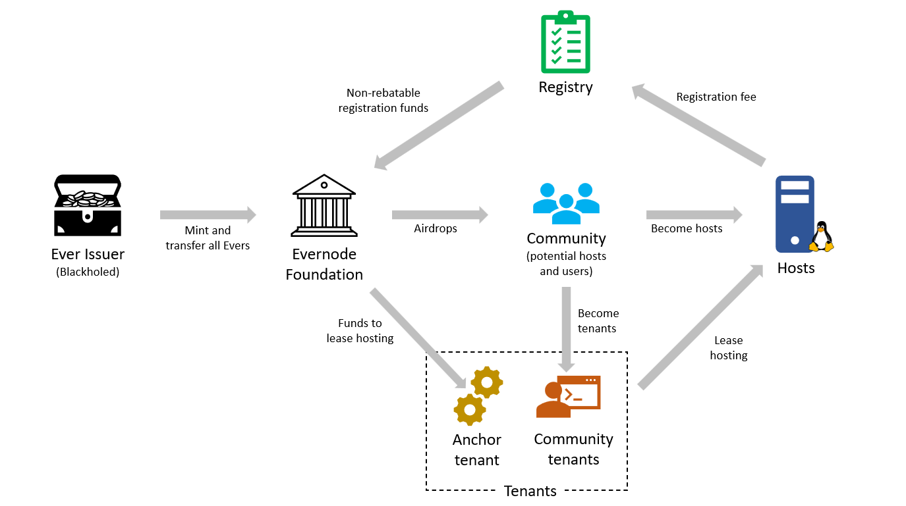

# Evers
Evernode uses **Evers** (EVR) as its native currency for all financial transactions in the marketplace. Evers are [tokens](https://xrpl.org/tokens.html) issued on the XRP Ledger with a guaranteed finite supply.

## Minting Evers
Evers are minted from a [blackholed](https://xrpl.org/accounts.html#special-addresses) XRPL account known as **Ever issuer** which guarantees that no more Evers can be issued after the initial minting. At launch, all Evers will be issued to the Evernode Foundation. The number of Evers to be minted is still to be confirmed.

## Uses of Evers
Hosts use Evers to pay for their registration on the network. Tenants use Evers to pay hosts for hosting services.

## Getting Evers
There are three ways of getting Evers: Airdrops, Hosting Fees, & Market Purchases.

### 1. Airdrops
Evernode Foundation plans to airdrop a portion (roughly 25%) of its Evers at launch to various ecosystem participants, including hosts and tenants who participate in the beta. The details of any such airdrop are not confirmed, but will be designed to ensure a sufficient supply of Evers for enthusiastic hosts and tenants to obtain the Evers they need to pay for registrations fees and hosting services. The Foundation reserves the right to, at any time and without notice, amend the details of any airdrop, include or exclude people or classes of people, or abandon the airdrop entirely (because, for example, the beta might fail and the network might never launch). You should participate in the beta because you want to help the Evernode Network succeed, not because you want an airdrop of Evers.

### 2. Earning Evers through Hosting Fees
Hosts can earn Evers by providing [hosting services](../hosts/index.md). Initially, the Foundation will act as anchor tenant to provide a reliable Hosting fee market through its [anchor tenant procurement program](../anchor-tenant/index.md).

#### Foundation as "Anchor Tenant"
Evernode Foundation plans to use most of its Evers to fund its [anchor tenant procurement program](../anchor-tenant/index.md). Under this service, the Evernode Foundation plans to purchase hosting for one or more community contracts from registered hosts according to published procurement rules. Any registered host that wishes to be paid the nominated fee(s) – in Evers - to host the community contract(s) will be able to participate. In this way, the Evernode Foundation will act as an anchor tenant for the network, providing early-adopting hosts with an option for a reliable stream of Evers income. The Foundation will publish its community contract procurement rules in due course. Those rules are, of course, subject to change depending on whether the Foundation believes its role as anchor tenant is appropriately underpinning the stable growth of the network.

### 3. Market Purchases
Since Evers are issued on the XRPL, anybody who wants to buy and/or sell Evers will be able to do so on the XRPL's native DEX. This is also the place where people can trade Hosting NFTs and Registration NFTs. While there is no reason why centralised exchanges might not list Evers, the Foundation has no plans to promote or secure the listing Evers on any exchange other than the XRPL's DEX.