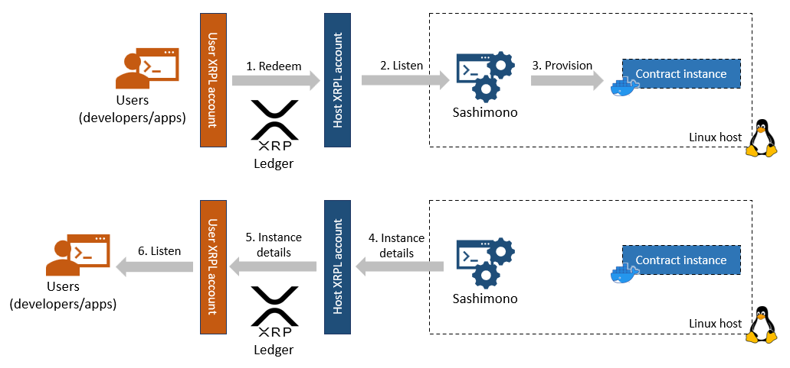
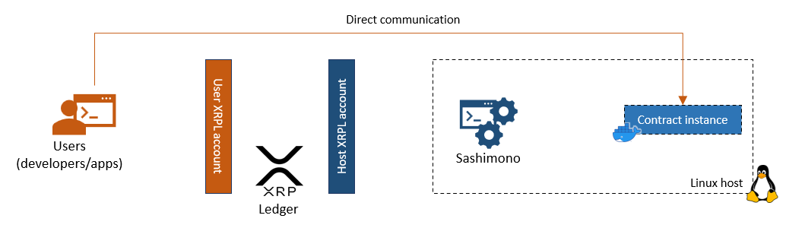

# Hosts
An Evernode host is a Linux server registered on the Evernode [Registry](../registry/index.md) via an [XRPL account](https://xrpl.org/accounts.html) owned and controlled by the host. The server runs a piece of Evernode software to open up the server hardware resources in a secure manner for Evernode [Tenants](../tenants/index.md) to host their smart contracts.

## Registration
The host registers on Evernode [Registry](../registry/index.md) by paying the [current registration fee](../tokenomics/index.md#regfee) with host metadata included in the payment transaction. Host metadata contains information such host server location, hardware resources and [hosting token](#hosting-tokens) currency code. The XRPL account used to make the registration payment is considered the **Host Account**. This account's [address](https://xrpl.org/accounts.html#addresses) identifies the host within Evernode.

Once the registration fee is paid, Evernode registry issues a **Registration NFT** to the host account. The Registration NFT acts as proof-of-membership of that host within Evernode. The host can sell the NFT back to Evernode Registry for half of prevailing registration fee at a later time. Upon this act, the registry will **deregister** the host from the membership registry.

## Hosting slices
A host can choose what amount of its total hardware resources (CPU, RAM, Disk space) is allocated for Evernode smart contract hosting. This resource allocation is further divided into a number of equal-sized "slices" chosen by the host. These **hosting slices** correspond to potential smart contract instances tenants can purchase (1 slice = 1 instance). They are just a numerical division of the host's total allocated hardware resources and are only actually utilized when smart contract instances get materialized as a result of purchase requests sent by tenants. In essence, the hosting slices are the product, which get sold at the [XRPL decentralized exchange](https://xrpl.org/decentralized-exchange.html), in exchange for [hosting tokens](#hosting-tokens).

## Hosting tokens
The host lists hosting tokens at the [XRPL decentralized exchange](https://xrpl.org/decentralized-exchange.html) (dex) at a price if its choosing. Hosting tokens are [XRPL tokens](https://xrpl.org/tokens.html) that are issued from the **Host Account** and is priced in Evers. They are indivisible and always represented as positive whole numbers. Tenants discover the hosting tokens from a particular host on the dex by checking the host account address and hosting token currency code recorded in the registry. Owning hosting tokens DOES NOT mean owning a smart contract instance. It simply means the right to request the host to provision an instance.

> 1 hosting token corresponds to the right to utilize 1 hosting slice for 1 Moment.

## Smart contract instances
After purchasing hosting tokens for a particular host from the dex (or by any other means), tenants can **Redeem** one or more of the tokens in exchange for a smart contract instance. This is performed as a [XRPL token payment](https://xrpl.org/cross-currency-payments.html) from tenant's XRPL account to the Host Account. If there are unutilized hosting slices, the host provisions a default contract instance on one of them. If no free slice was available, host refunds the token payment with an error code.

When a contract instance get created, it is assigned a unique **instance name**. This is a [UUID](https://en.wikipedia.org/wiki/Universally_unique_identifier) which can be used to identify an instance within the host. This, along with other instance details such as communication port numbers and domain/ip addresses are returned back to the tenant who redeemed the hosting tokens.

The amount of hosting token that was "redeemed" defines the lifespan of the provisioned contract instance (1 token = 1 Moment of run time). After the run time "expires", the host deletes the instance and that hosting slice becomes available for future redeems again. The contract instance could be kept alive by redeeming more hosting tokens tagged with the **instance name** before the instance expires.

[Sashimono](sashimono.md) is the software which manages the contract instances on the host. It is capable of listening to incoming redeem requests from Evernode tenants on the host's XRPL account and appropriately provisioning contract instances. It uses [Docker](https://www.docker.com) to isolate contract instances from each other.

After the tenant receives the instance details, direct communication with the instance can be initiated without going through XRP Ledger or Sashimono.

To learn more about communicating with a contract instance, see [Hot Pocket](../hot-pocket/index.md)

## Installation
[Evernode setup](setup.md) makes the entire process of registering and participating as an Evernode host a hassle free experience. With a guided set of steps, it can automatically register a Linux host on Evernode registry and serve incoming Redeem requests from tenants. It also installs the ncessary tools for the host administrator to manage the contract instances that have been provisioned on the host.