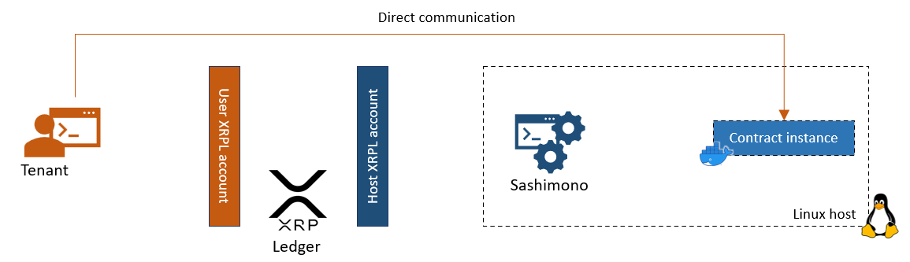

# Hosts
An Evernode host is a Linux server registered on the Evernode [Registry](../registry/index.md) via an [XRPL account](https://xrpl.org/accounts.html) owned and controlled by the host. The server runs a piece of Evernode software to open up the server hardware resources in a secure manner for Evernode [Tenants](../tenants/index.md) to host their smart contracts.

## Registration
The host registers on Evernode [Registry](../registry/index.md) by paying the [current registration deposit](../tokenomics/index.md#regfee) with host metadata included in the payment transaction. Host metadata contains information such host server location and hardware resources. The XRPL account used to make the registration payment is considered the **Host account**. This account's [address](https://xrpl.org/accounts.html#addresses) identifies the host within Evernode.

Once the registration deposit is paid, Evernode registry issues a **Registration NFT** to the host account. The Registration NFT acts as proof-of-membership of that host within Evernode. The host can sell the NFT back to Evernode Registry for half of prevailing registration deposit at a later time. Upon this act, the registry will **deregister** the host from the membership registry.

## Hosting slots
A host can choose what amount of its total hardware resources (CPU, RAM, Disk space) is allocated for Evernode smart contract hosting. This resource allocation is further divided into a number of equal-sized "slices" chosen by the host. These **hosting slots** correspond to potential smart contract instances tenants can purchase (1 slice = 1 instance). They are just a numerical division of the host's total allocated hardware resources and are only actually utilized when smart contract instances get materialized as a result of a tenant acquiring a lease. Eech hosting slot is represented using a **Hosting NFT** which can be bought for Evers which signifies a lease acquisition.

## Hosting NFTs
The host mints and offers hosting NFTs to represent all hosting slots on the host (N slices = N nfts). Hosting NFTs are always priced at the **Lease amount** in Evers, the price of hosting a smart contract for 1 [Moment](#moment). A tenant must purchase a hosting NFTs in order to own a smart contract instance. Upon purchase, the tenant has essentially acquired a lease of a hosting slot which is due to expire in 1 Moment. The tenant can extend the lease by paying sufficient Evers to lease any number of future Moments in advance (lease amount = price of 1 Moment of hosting).

> Owning a hosting NFT means the right to own a smart contract instance for 1 Moment and the right to pay for future Moments of that instance.

## Moment
"Moment" is the measure of time in Evernode. It is calcualted using "XRPL ledgers elapsed". Moment is the smallest duration that a smart contract instance can be paid and hosted for. Currently, a Moment is defined as 72 XRPL ledgers.

## Smart contract instances
When a tenant acquires a lease (purchases a hosting NFT), the host provisions a default contract instance on a hosting slot. The instance is assigned a unique **instance name**, which is derived from the purchased NFT itself. This can be used to identify a particular instance within the host. This, along with other instance details such as communication port numbers and domain/ip addresses are returned back to the tenant who acquired the lease.

Lifetime of the contrace instance is the lifetime of the lease. As long as the lease is being paid for, contract instance will continue to function. Lease acquisition automatically guarantees a lifetime of 1 Moment. Lifetime can be extended by paying corresponding amount of Evers as specified in lease amount (N x lease amount = N future Moments of lifetime). Then the lease expires, the host deletes the instance and that hosting slot becomes available for a new lease again. At this point, the host burns the existing hosting NFT and re-issues a new NFT to replace it.

[Sashimono](sashimono.md) is the software which manages the contract instances on the host. It is capable of listening to hosting NFT purchases (lease acquisitions) from Evernode tenants on the host's XRPL account and appropriately provisioning contract instances. It uses [Docker](https://www.docker.com) to isolate contract instances from each other.

After the tenant receives the instance details, direct communication with the instance can be initiated without going through XRP Ledger or Sashimono.

To learn more about communicating with a contract instance, see [HotPocket](../hot-pocket/index.md)

## Installation
[Evernode setup](https://github.com/HotPocketDev/evernode-host) makes the entire process of registering and participating as an Evernode host a hassle free experience. With a guided set of steps, it can automatically register a Linux host on Evernode registry and serve lease acquisitions from tenants. It also installs the ncessary tools for the host administrator to manage the contract instances that have been provisioned on the host.