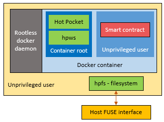
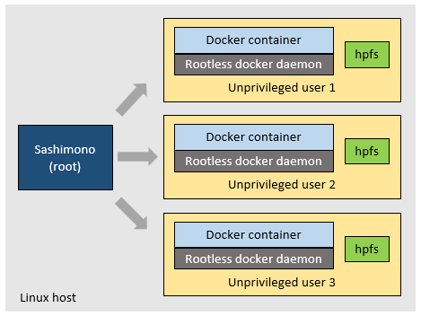

# Sashimono
Sashimono is the software which runs on all Evernode hosts enabling them to participate in Evernode and provide smart contract hosting services to Evernode tenants. It is installed on a host via the [Evernode setup](https://github.com/HotPocketDev/evernode-host). Sashimono performs several jobs:
1. Interact with the XRP Ledger on behalf of the host XRPL account.
2. Provision and manage smart contract instances as requested by tenants.
3. Perform routine tasks that are cruicial for the upkeep of your host on Evernode.

## XRPL integration
Sashimono possesses access to the keys of the host's XRPL account which represents the host on Evernode registry. It uses the keys to interact with the XRP Ledger on behalf of the host account. It performs following activities on XRP Ledger.
1. Offers leases for contract instances by issuing [hosting NFTs](index.md#hosting-nfts).
2. Serves lease acquisitions sent to the host account by Evernode tenants.
3. Ensure the current host status is reflected on the Evernode registry.

## Contract instance structure
Sashimono provisions contract instances in response to leases acquired by tenants. Each leased instance consists of following components:

1. [Hot Pocket](../hot-pocket/index.md) - Evernode's smart contract executation and consensus engine.
2. [hpws](https://github.com/RichardAH/hpws) - WebSockets protocol software used by Hot Pocket.
3. hpfs - Filesystem software based on [FUSE](https://www.kernel.org/doc/html/latest/filesystems/fuse.html) used by Hot Pocket to maintain contract state and blockchain.
4. Contract binaries - The smart contract application files provided by the tenant.
5. Contract data - Persisted smart contract data (contract state) and blockchain data files.

Different contract instances on the same host can be leased by different tenants. Hence, Sashimono ensures that the contract instances cannot interfere with each other or the host itself. For that, it uses [Docker](https://www.docker.com) and Linux user account security to isolate contract instances from one another. Furthermore, it also makes sure that the smart contract itself cannot interfere with the infrastructure services within the instance such as Hot Pocket.

The following diagram depicts how Sashimono structures the execution of different components of a contract instance.

For each contract instance, Sashimono creates an unpriviledged Linux user and runs all the infrastructure components and custom contract binaries in the context of that tenant. This provides security isolation between components of different contract instances.

Read more on [Sashimono blog post](http://blog.geveo.com/Sashimono-Designing-a-multi-tenant-dApp-hosting-platform)