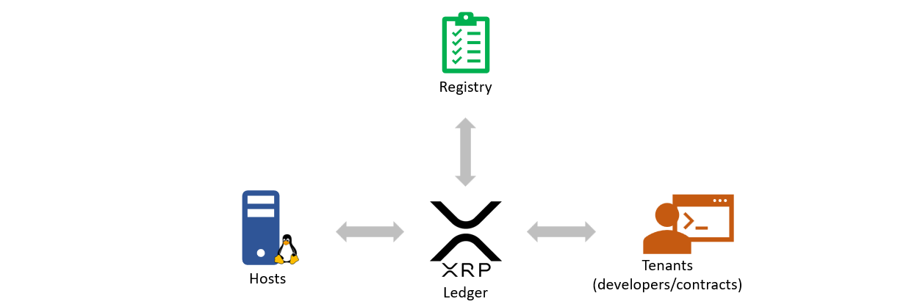
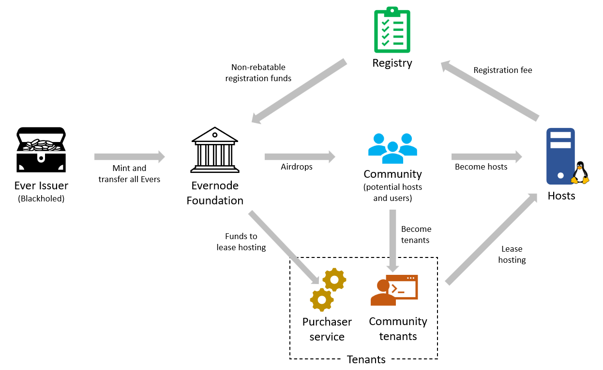

# Evernode
[Evernode](https://evernode.wordpress.com/) is a decentralized marketplace for hosting smart contracts. Evernode brings several decentralized technology innovations together to provide a global network of severs which is capable of hosting smart contracts. It consists of [Hosts](hosts/index.md), which are Linux servers capable of hosting smart contracts; [Registry](registry/index.md), which maintains a directory of participating hosts; and [Tenants](tenants/index.md) who purchase server space from Hosts in order to run smart contracts. The interactions and the financial activities between these parties are facilitated by the [XRP Ledger](https://xrpl.org).

## Financial model
Evernode finances are modeled using [XRPL tokens](https://xrpl.org/tokens.html). Evernode uses **Evers** (EVR) as its native currency for all financial transactions in the marketplace. Evers are issued by the Evernode Foundation and is guaranteed to be finite in supply. Hosts pay their registration fee in Evers. Hosts value their server space against Evers. Tenants can purchase hosting using Evers. Hosting is sold and bought on the [XRPL decentralized exchange](https://xrpl.org/decentralized-exchange.html). To facilitate that, a [unit of hosting](hosts/index.md) is represented using **hosting tokens** which, like **Evers**, are [XRPL tokens](https://xrpl.org/tokens.html) but are issued and controlled by Hosts.

The initial phase of Evernode will see to it that a portion of the limited Ever supply find its way to the hands of the community by means of airdrops. The community can use these Evers to register as Hosts or to purchase hosting (represented by hosting tokens) from registered Hosts. The rest will be progressively distributed by the [Evernode Purchaser Service](purchaser/index.md), as perpetual hosting token purchases from all registered Hosts in order to host the [Community Contract](purchaser/community-contract.md). This ensures early participants of the network will have a steady income for making their server space available on Evernode. See [Evernode tokenomics](tokenomics/index.md).

## Further reading
- [Registry](registry/index.md)
- [Hosts](hosts/index.md)
- [Tenants](tenants/index.md)
- [Purchaser service](purchaser/index.md)
- [Evernode tokenomics](tokenomics/index.md)

## Evernode news
- [@EvernodeXRPL](https://twitter.com/EvernodeXRPL) on Twitter
- [Evernode website](https://evernode.wordpress.com)