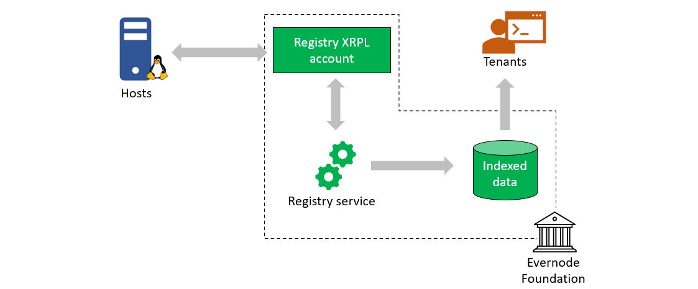

# Registry
Evernode registry maintains the membership listing of all the hosts that have registered on Evernode. It is also the central place of truth about the Evernode network configuration parameters. The hosts interact with the well-known XRPL account denoted by **Registry Address** which is controlled by the Evernode registry service. Tenants can use the registry to find out latest details about member hosts.

Registry service interprits the membership management requests arriving at the registry XRPL account while maintaining a database of indexed membership and network configuration data. Tenants can use indexed data to find out information about registered Evernode hosts.

> _For any party who wishes to interact with Evernode, **Registry Address** is the entry point into the Evernode network._

## Network configuration
Evernode registry keeps several global configuration parameters that applies to the entire Evernode network in an accessible manner. Here are some of the important ones:

- Ever issuer address
- Ever issuance limit
- Current registration deposit in Evers
- Moment duration
- Base market price of hosting leases

## Registry operations
A new host requests for Evernode membership by initiating an XRPL payment of Evers equal to the current registration deposit.

Upon successful processing, the registry service issues the **Registration NFT** to the host. The Registration NFT acts as proof-of-membership of that host within Evernode and confirms the host is legally licensed to run the Evernode software. The host can sell the NFT back to registry for half of prevailing registration deposit at a later time, or it can sell the NFT to another host. At this point, the registry service will **deregister** the host and clear the host data from the registry.

Five (5) Evers of the registration deposit are non-refundable. The remaining deposit is refundable as the network grows.  The registration deposit halves whenever the number hosts grows beyond certain milestones. When such "halving" happens, all existing members are rebated the excess Evers they have on deposit. In this way, all but 5 Evers of the registration deposit will ultimately be refunded to hosts, assuming the network grows to the relevant size.

## Future based on XRPL hooks
In the future, when [XRPL hooks amendment](https://xrpl-hooks.readme.io) is finalized, it is anticipated that the Evernode registry service becomes a "Hook" on the XRP Ledger. WHen this happens, the host membership information can be read directly from the XRP Ledger by tenants.