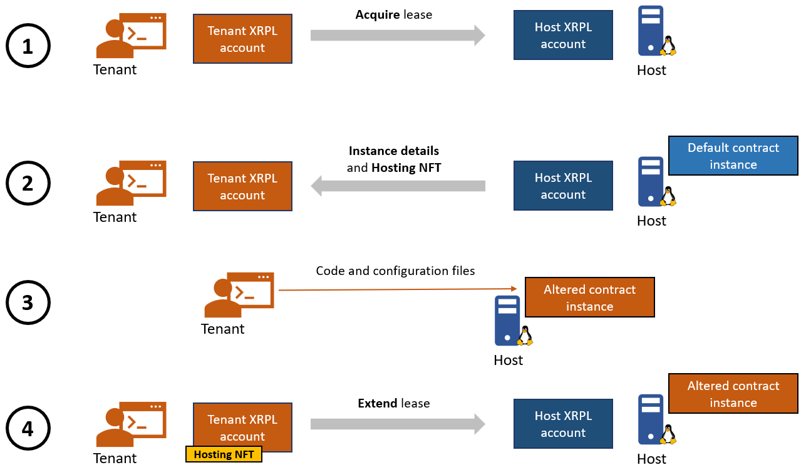
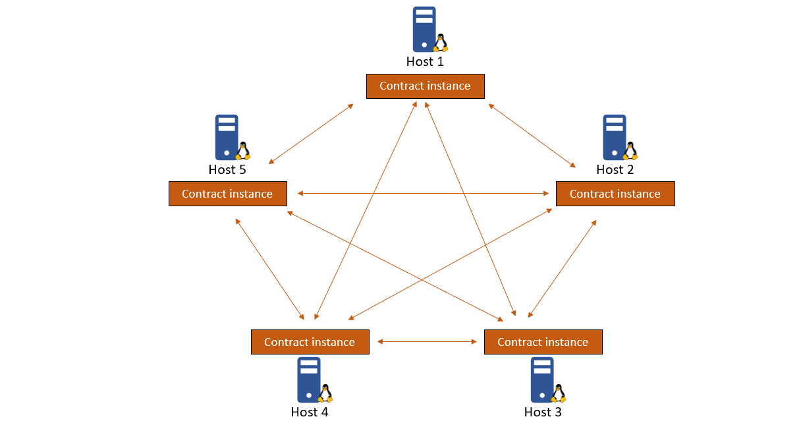

# Tenants
An Evernode tenant is an entity which leases a hosting slot in order to host a smart contract instance in return for paying an agreed hosting fee in Evers for each [moment](../index.md#moment) of hosting. In the real world, tenants can be developers or applications that wants to create and maintain smart contract instances. 

## Contract instances
To launch an instance of a contract on a host, the tenant must first **acquire** a lease, represented by a [Hosting NFT](../hosts/index.md#hosting-nfts). The Hosting NFT represents a promise to provision a slot for an instance in return for an agreed fee – in Evers – per [Moment](../index.md#moment) of hosting. By owning the Hosting NFT the tenant gains access to a slot with a freshly-provisioned default [HotPocket](../hotpocket/index.md) smart contract instance. The tenant then replaces the empty default contract with its own contract. The instance persists each Moment for so long as the tenant owns the Hosting NFT for that slot and pays the agreed fee in Evers for each Moment of hosting.

## Contract clusters
Using the above flow, a tenant can create multiple contract instances and configure them to talk to each other. Such a group of instances form a contract cluster which can perform [consensus](../hotpocket/index.md#consensus) and synchronize with each other.

